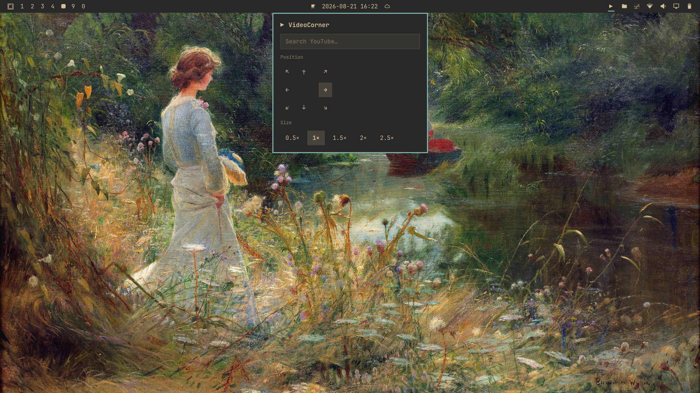
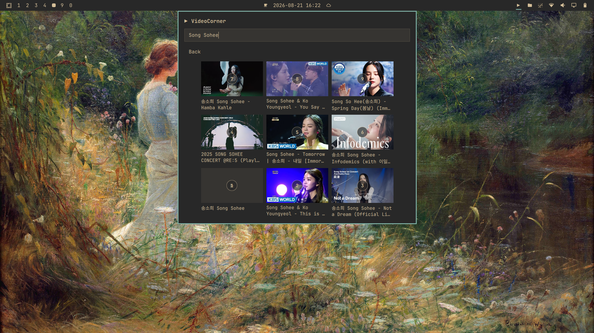
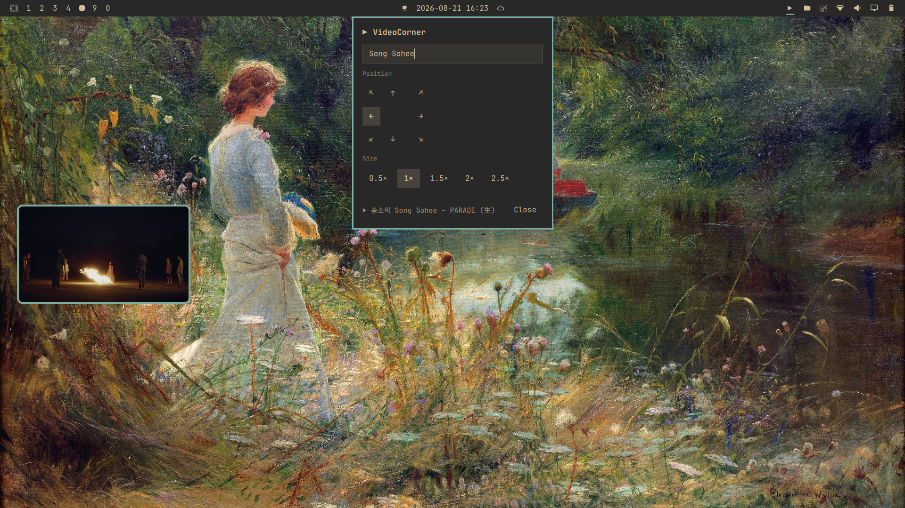

# VideoCorner

Search YouTube from the Omarchy bar and pop the selected video into a floating,
pinned, movable player window.







## Features

- YouTube search through `yt-dlp`
- Floating, pinned player that auto-matches the video's real aspect ratio
- Video-only layout (no page chrome) via a bundled Chromium extension
- Full native YouTube controls — play, pause, seek, volume, captions, settings
- Configurable corner and size

## Usage

Click the **▶** bar icon to open the panel, type to search, then click a video
or press `Ctrl+1…9` to play it. Move/resize the player from the panel.

## Keys
While Panel is open
| Key | Action |
|---|---|
| `Ctrl+1…9` | play the numbered video |
| `Ctrl+↑↓←→` / Ctrl+`h/j/k/l` | move the player around |
| `Ctrl+=` / `Ctrl+-` | resize up / down |
| `Ctrl++` / `Ctrl+_` | max/min size |
| `Ctrl+Q` | close the video |
| `Esc` / `Ctrl+[` | close the panel (back to main view from results) |

## Requirements

- Omarchy Quattro
- Chromium
- `yt-dlp` which uses an api to search for youtube videos

## Install

Use Omarchy's SUPER+SPACE->Setup->Plugins->Add Plugin
and enter the url

```bash
https://github.com/brianspragge/videocorner.git
```

Then register the Chromium extension for the video-only player layout and
restart Chromium by running:

```sh
~/.config/omarchy/plugins/bms.videocorner/scripts/install-extension.sh
```

**Optional: add a keyboard shortcut**

To open and close VideoCorner from anywhere, add this line to your personal
Hyprland keybindings file, `~/.config/hypr/bindings.lua`:

```lua
o.bind("SUPER + CTRL + Y", "VideoCorner", "omarchy-shell shell toggle bms.videocorner")
```

Clicking the **▶** bar icon also works, so this keybind is optional.

## Remove

Run

```bash
~/.config/omarchy/plugins/bms.videocorner/scripts/remove-extension.sh
```
Use Omarchy's SUPER+SPACE->Setup->Plugins->Remove Plugin
ITS GONE like nothing ever happened.

## Transparency

VideoCorner runs only when you open its panel or play a video. It does not
intercept or change input for any other application or window.  Extension is
minimal without peeping at your junk.

**What the extension installer touches**

The `install-extension.sh` script edits exactly one file:

`~/.config/chromium-flags.conf`

- It appends the VideoCorner extension path to the existing `--load-extension=`
  line (or adds that line if it's absent).
- Every other line in the file is left untouched.
- It is idempotent: running it again does nothing.

**What it does not touch**

- Hyprland, its input handling, or any keybindings
- `~/.config/omarchy/shell.json` or any other Omarchy settings
- Browser history, bookmarks, cookies, or other Chromium data
- Any other application, window, or remote session (e.g. browser-based
  environments like GitHub Codespaces)

**Player extension scope**

The bundled Chromium extension only activates for URLs containing
`videocorner=1` (your selected video). Regular YouTube tabs and all other sites
are unaffected.  It isn't necessary, but then you will have to manually enlarge
every video you search for.  The extension removes all the youtube page css junk.

**Removal**

`scripts/remove-extension.sh` strips only the VideoCorner entry from
`~/.config/chromium-flags.conf`, leaving every other flag and file intact.

## License

[MIT](LICENSE) © 2026 Brian Spragge
